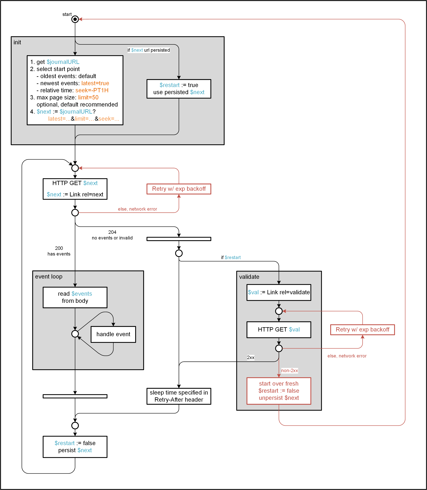

# Asset Compute Service HTTP API {#asset-compute-http-api}

The article describes the HTTP API. A high-level flow for clients of the service is below:

1. Client is provisioned as Adobe Developer Console integration in an IMS organization. Each separate system or environment has its own separate integration, in order to isolate the journal.

   >[!NOTE]
   >
   >In Adobe Experience Manager as a Cloud Service, it happens automatically, except for the stage environments.

1. Client generates an access token for the technical account using the [JWT (Service Account) Authentication](https://www.adobe.io/authentication/auth-methods.html).

1. Client calls [`/register`](#register) first to retrieve the journal URL.

1. Client calls [`/process`](#process-request) for each asset for which it wants to generate N renditions. This is asynchronous.

1. Client regularly polls the journal to [receive events](#asynchronous-events) for each requested rendition when it has been successfully processed or if there was an error.

## Authentication and authorization {#authentication-and-authorization}

All APIs require access token authentication. The requests must set the following headers:

1. `Authorization` header with bearer token, which is the technical account token, received via [JWT exchange](https://www.adobe.io/authentication/auth-methods.html) from Adobe Developer Console integration. The [scopes](#scopes) are documented below.

<!-- TBD: Change the existing URL to a new path when a new path for docs is available. The current path contains master word that is not an inclusive term. Logged ticket in AIO's GitHub repo to get a new URL.
-->

1. `x-gw-ims-org-id` header with the IMS organization ID.

  >[!NOTE]
  >
  >Currently, set a `x-ims-org-id` header with the same org ID value.

1. `x-api-key` with the client ID from the Adobe Developers Console integration.

### Scopes {#scopes}

Ensure the following scopes for the access token:

* `openid`
* `AdobeID`
* `asset_compute`
* `read_organizations`
* `event_receiver`
* `event_receiver_api`
* `adobeio_api`
* `additional_info.roles`
* `additional_info.projectedProductContext`

These require the Adobe Developer Console integration to be subscribed to `Asset Compute`, `I/O Events`, and `I/O Management API` services. The breakdown of individual scopes is:

* Basic
  * scopes: `openid,AdobeID`

* Asset Compute
  * metascope: `asset_compute_meta`
  * scopes: `asset_compute,read_organizations`

* Adobe I/O Events
  * metascope: `event_receiver_api`
  * scopes: `event_receiver,event_receiver_api`

* Adobe I/O Management API
  * metascope: `ent_adobeio_sdk`
  * scopes: `adobeio_api,additional_info.roles,additional_info.projectedProductContext`

## Registration {#register}

For an existing technical account (Adobe Developer Console integration), create an Asset Compute service registration that is required before the first request to `/process`. It returns the Event journal URL to receive asynchronous events.

For an existing technical account (Adobe Developer Console integration) that was setup for Asset Compute with `/register`, you can remove the setup and journal.

### Register request {#register-request}

| Parameter                | Value                                                |
|--------------------------|------------------------------------------------------|
| Method                   | `POST`                                               |
| Path                     | `/register`                                          |
| Header `<authorization>` | All [authorization related headers](#authentication-and-authorization). |
| Header `x-request-id` | Optional, can be set by clients for a unique end-to-end identifier of the processing requests across systems. See also [API Gateway documentation](https://wiki.corp.adobe.com/display/API/API+Gateway+Header+Fields+Documentation). |

Ensure that the body of the request is empty.

### Register response {#register-response}

MIME type is `application/json`. Header `X-Request-Id` is either the same as the `X-Request-Id` set in the header or a uniquely generated one. Use for identifying requests across systems and for support requests. See also API Gateway documentation.

<!--
Attention: Add publicly available version of the page as a link. https://wiki.corp.adobe.com/display/API/API+Gateway+Header+Fields+Documentation
-->

The status codes are:

* **200 Success**: If the request is successful. It contains the `journal` URL that is to be notified about any results of the asynchronous processing triggered via `/process`.

  ```json
  {
      "ok": true,
      "journal": "https://api.adobe.io/events/organizations/105979/integrations/47334/f761f39a-469a-4c36-b91b-8de033912393",
      "requestId": "1234567890
  }
  ```

* **401 Unauthorized**: If the request does not have valid [authentication](#authentication-and-authorization). An example might be an invalid access token or invalid API key.
* **403 Forbidden**: If the request does not have valid [authorization](#authentication-and-authorization). An example might be a valid access token, but the Adobe Developer Console integration (technical account) is not subscribed to all required services.
* **429 Too many requests**: If the system is overloaded by this client or in general. Clients should retry with an [exponential backoff](https://en.wikipedia.org/wiki/Exponential_backoff). The body will be empty.
* **4xx error**: If there was any other client error and registration failed. Usually a JSON such as this is returned, although that is not guaranteed for all errors:

  ```json
  {
      "ok": false,
      "requestId": "1234567890,
      "message": "error message"
  }
  ```

* **5xx error**: If there was any other server side error and registration failed. Typically a JSON file such as this is returned, although that is not guaranteed for all errors:

  ```json
  {
      "ok": false,
      "requestId": "1234567890,
      "message": "error message"
  }
  ```

### Unregister request {#unregister-request}

|        |        |
|--------|--------|
| Method | `POST` |
| Path   | `/unregister` |
| Header `<authorization>` | All [authorization related headers](#authentication-and-authorization). |
| Header `x-request-id` | Optional, can be set by clients for a unique end-to-end identifier of the processing requests across systems. |

The request body is empty.

### Unregister response {#unregister-response}

MIME type is `application/json`. The header `X-Request-Id` is either the same as the `X-Request-Id` set in the header or a uniquely generated one. Use to identify requests across systems and support requests.

The status codes are:

* **200 Success** if the registration and journal is found and removed.

  ```json
  {
      "ok": true,
      "requestId": "1234567890
  }
  ```

* **401 Unauthorized**: if the request does not have valid [authentication](#authentication-and-authorization). An example might be an invalid access token or invalid API key.
* **403 Forbidden**: if the request does not have valid [authorization](#authentication-and-authorization). An example might be a valid access token, but the Adobe Developer Console integration (technical account) is not subscribed to all required services.
* **404 Not found** if there is no current registration for the given credentials.

  ```json
  {
      "ok": true,
      "requestId": "1234567890
  }
  ```

* **429 Too many requests**: If the system is overloaded by this client or in general. Clients should retry with an [exponential backoff](https://en.wikipedia.org/wiki/Exponential_backoff). The body will be empty.

* **4xx error** if there was any other client error. Usually a JSON such as this is returned, although that is not guaranteed for all errors:

  ```json
  {
      "ok": false,
      "requestId": "1234567890,
      "message": "error message"
  }
  ```

* **5xx error** if there was any other server side error. Usually a JSON such as this is returned, although that is not guaranteed for all errors:

  ```json
  {
      "ok": false,
      "requestId": "1234567890,
      "message": "error message"
  }
  ```

## Asset processing {#asset-processing}

For a list of the supported file formats, see [supported file formats](https://docs.adobe.com/content/help/en/experience-manager-cloud-service/assets/file-format-support.html).

The `process` operation submits a job that will transform a source asset into multiple renditions, based on the instructions in the request. Notifications about successful completion or any errors are sent to an Event journal that must be retrieved using [/register](#register) once before making any number of `/process` requests. Incorrectly formed requests immediately fail with a 400 error code.

### Process request {#process-request}

|        |        |
|--------|--------|
| Method | `POST` |
| Path   | `/process` |
| Mime type | `application/json` |
| Header &lt;authorization&gt; | All [authorization related headers](#authentication-and-authorization). |
| Header `x-request-id` | Optional, can be set by clients for a unique end-to-end identifier of the processing requests across systems. See also [API Gateway documentation](https://wiki.corp.adobe.com/display/API/API+Gateway+Header+Fields+Documentation). |

The request body must be in JSON format. It provides instructions on what asset to compute and what renditions to generate.

Binaries are referenced using URLs, such as Amazon AWS S3 pre-signed URLs or Azure Blob Storage SAS URLs, for both reading the `source` asset (`GET` URLs) and writing the renditions (`PUT` URLs).

To generate pre-signed S3 URLs, these scripts might help, because the standard AWS CLI only supports pre-sign of GET: [s3-presign-put](https://git.corp.adobe.com/aklimets/scripts/blob/master/cloud/s3-presign-put), [s3-presign-get](https://git.corp.adobe.com/aklimets/scripts/blob/master/cloud/s3-presign-get).

#### Process request JSON Fields {#process-request-json-fields}

```json
{
    "source": "", // source url
    "renditions" : [], // array with 1..N requested renditions, including target locations
    "userData": {} // custom user data for events
}
```

The available fields are:

| Name | Type | Description | Example |
|------|------|-------------|---------|
| `source` | `string` | URL of the source asset to process. Optional (some renditions like `fmt=zip` might not require it) | `"http://example.com/image.jpg"` |
| `source` | `object` | Describing the source asset to process. See description of [Source object fields](#source-object-fields) below. Optional (some renditions might not require it) | `{"url": "http://example.com/image.jpg", "mimeType": "image/jpeg" }` |
| `renditions` | `array` | Renditions to generate from the source file. Each rendition object supports [rendition instruction](#rendition-instructions). Required. | `[{ "target": "https://....", "fmt": "png" }]` |
| `userData` | `string` | Object for passing custom client information that is sent to all events. For example, this allows for passing a custom asset ID to identify assets in events if that is not possible with the `source` URL itself. Optional. | `{ "my-asset-id": "0123456789" }` |

Note that `source` can either be a `<string>`, which is seen as URL, or an `<object>` with additional field. The following variants are identical:

```json
"source": "http://example.com/image.jpg"
```

```json
"source": {
    "url": "http://example.com/image.jpg"
}
```

#### Source object fields {#source-object-fields}

| Name | Type | Description | Example |
|------|------|-------------|---------|
| `url` | `string` | URL pointing to the source binary. Supports AWS/Azure pre-signed URLs. Required. | `"http://example.com/image.jpg"` |
| `name` | `string` | File name. File extension in the name might be used if no MIME type can be detected. Takes precedence over filename in URL path or filename in content-disposition header of the binary resource. Defaults to "file". | `"image.jpg"` |
| `size` | `number` | File size in bytes. Takes precedence over content-length header of the binary resource. | `10234` |
| `mimetype`| `string` | MIME type. Takes precedence over the content-type header of the binary resource. | `"image/jpeg"` |

#### A complete `process` request example {#complete-process-request-example}

```json
{
    "source": "https://www.adobe.com/content/dam/acom/en/lobby/lobby-bg-bts2017-logged-out-1440x860.jpg",
    "renditions" : [{
            "name": "image.48x48.png",
            "url": "https://some-presigned-put-url-for-image.48x48.png",
            "fmt": "png",
            "wid": 48,
            "hei": 48
        },{
            "name": "image.200x200.jpg",
            "url": "https://some-presigned-put-url-for-image.200x200.jpg",
            "fmt": "jpg",
            "wid": 200,
            "hei": 200
        },{
            "name": "cqdam.xmp.xml",
            "url": "https://some-presigned-put-url-for-cqdam.xmp.xml",
            "fmt": "xmp"
        },{
            "name": "cqdam.text.txt",
            "url": "https://some-presigned-put-url-for-cqdam.text.txt",
            "fmt": "text"
    }],
    "userData": {
        "my-asset-id": "1234567890"
    }
}
```

### Process response {#process-response}

|        |        |
|--------|--------|
| Mime type | `application/json` |
| Header `X-Request-Id` | Either the same as the `X-Request-Id` set in the header or a uniquely generated one. Use for identifying requests across systems and/or support requests. See also [API Gateway documentation](https://wiki.corp.adobe.com/display/API/API+Gateway+Header+Fields+Documentation). |

This request will return immediately with success or failure based on basic request validation. Actual asset processing will happen asynchronously.

Status codes:

* **200 Success**: If the request was successfully submitted. Response JSON also includes `"ok": true`:

  ```json
  {
      "ok": true,
      "requestId": "1234567890,
      "activationId": "legacy-id"
  }
  ```

* **400 Invalid request**: If the request is incorrectly formed, such as incorrect attributes in the request JSON.The response JSON also includes `"ok": false`:

  ```json
  {
      "ok": false,
      "requestId": "1234567890,
      "message": "error message"
  }
  ```

* **401 Unauthorized**: if the request does not have valid [authentication](#authentication-and-authorization). An example might be an invalid access token or invalid api key.
* **403 Forbidden**: if the request does not have valid [authorization](#authentication-and-authorization). An example might be a valid access token, but the IO console integration (technical account) is not subscribed to all required services.
* **429 Too many requests**: if the system is overloaded by this client or in general. Clients should retry with an [exponential backoff](https://en.wikipedia.org/wiki/Exponential_backoff). The body will be empty.
* **4xx error** if there was any other client error. Usually a JSON such as this is returned, although that is not guaranteed for all errors:

  ```json
  {
      "ok": false,
      "requestId": "1234567890,
      "message": "error message"
  }
  ```

* **5xx error** if there was any other server side error. Usually a JSON such as this is returned, although that is not guaranteed for all errors:

  ```json
  {
      "ok": false,
      "requestId": "1234567890,
      "message": "error message"
  }
  ```

Most clients are likely inclined to retry the exact same request with [exponential backoff](https://en.wikipedia.org/wiki/Exponential_backoff) on any error *except* configuration issues such as 401 or 403, or invalid requests like 400. Apart from regular rate limiting via 429 responses, a temporary service outage or limitation might result in 5xx errors for some time, and a client wanting to process assets could retry once that is over.

All JSON responses (if present) include the `requestId` which is the same value as the `X-Request-Id` header. It is recommended to read from the header, since it is always present. The `requestId` is also returned in all I/O events related to this processing requests, as `requestId` field on the event. Clients must not make any assumption about the format of this string, it is an opaque string identifier.

For backwards compatibility with the beta API, an `activationId` is returned. It is deprecated and will be removed in the future. New clients instead use `requestId`/`X-Request-Id`.

## Rendition instructions {#rendition-instructions}

These are the available instructions for the `renditions` array in [/process](#process-request). Most rendition fields currently follow the [Scene7 ImageServing command format](https://marketing.adobe.com/resources/help/en_US/s7/is_ir_api/is_api/http_ref/c_command_reference.html). However, this will change to align with the [Platform API](https://git.corp.adobe.com/pages/AdobeCloudPlatform/api-spec/) and [XDM](https://github.com/adobe/xdm) and use, for example, `width` and `height`.

<!-- Attention: Remove reference to git.corp.
-->

| Name | Type | Description | Example | Change note |
|------|------|-------------|---------|-------------|
| `fmt`  | `string` | The target format, can also be `text` for text extraction and `xmp` for extracting XMP metadata as xml. see [supported formats](https://docs.adobe.com/content/help/en/experience-manager-cloud-service/assets/file-format-support.html) | `png` | Changes to `type` specifying a MIME types or [UTI](https://git.corp.adobe.com/nui/nui/issues/142) |
| `target` or `url` | `string` | URL to which the generated rendition should be uploaded using HTTP PUT. | `http://w.com/img.jpg` | |
| `target` | `object` | Multipart pre-signed URL upload information for the generated rendition. This is for [AEM/Oak Direct Binary Upload](https://jackrabbit.apache.org/oak/docs/features/direct-binary-access.html) with this [multipart upload behavior](http://jackrabbit.apache.org/oak/docs/apidocs/org/apache/jackrabbit/api/binary/BinaryUpload.html).<br>Fields:<ul><li>`urls`: array of strings, one for each pre-signed part URL</li><li>`minPartSize`: the minimum size to use for one part = url</li><li>`maxPartSize`: the maximum size to use for one part = url</li></ul> | `{ "urls": [ "https://part1...", "https://part2..." ], "minPartSize": 10000, "maxPartSize": 100000 }` | |
| `wid` | `number` | Width in pixels. only for image renditions. | `200` | It will change to `width`. |
| `hei` | `number` | Height in pixels. only for image renditions. | `200` | It will change to `height`. |
| | |  - if only `wid` or `hei` is specified, the resulting image will use that and keep the aspect ratio<br> - without `wid` and `hei`, the original image pixel size is used. It depends on the source type. For some formats, such as PDF files, a default size is used. | | |
| `qlt` | `number` | Specify jpeg quality in the range of `1` to `100`. Applicable only for image renditions. | `90` | It will change to `quality` soon. |
| `xmp`| `string` | Used only by XMP metadata writeback, it is base64 encoded XMP to write back to the specified rendition. | |  |
| `interlace` | `bool` | Create interlaced PNG or GIF or progressive JPEG by setting it to true. It has no effect on other file formats. | | |
| `jpegSize` | `number` | approximate size of JPEG file in bytes. note this overrides any `qlt` setting. has no effect on other formats | | |
| `dpi` | `number` or `object` | Set x and y dpi. For simplicity, it can also be set to a single number in which case the two values are identical. It has no effect on the image itself. | `96` or `{ xdpi: 96, ydpi: 96 }` | |
| `convertToDpi` | `number` or `object` | x and y dpi to resample to while maintaining physical size.  for simplicity it can also be set to a single number in which case the two values will be identical. | `96` or `{ xdpi: 96, ydpi: 96 }` | |
| `files` | `array` | ZIP archival (`fmt=zip`).<br> List of files to include in the ZIP archive. Each entry can either be a URL or an object with the fields:<ul><li>`url`: URL to download asset</li><li>`path`: Store asset under this path in the ZIP</li></ul> | `[{ "url": "https://host/asset.jpg", "path": "folder/location/asset.jpg" }]` | |
| `duplicate` | `string` | ZIP archival (`fmt=zip`).<br> Duplicate handling. By default multiple assets stored under the same path in the ZIP will generate an error. Setting `duplicate` to `ignore` will result in only the first asset to be stored and the rest to be ignored. | `ignore` | |
| `worker` | `string` | URL of a [custom worker](develop-custom-worker.md). Must be a `https://` URL. If this field is present, the rendition is created by a custom worker. Any other field for the rendition is then for the custom worker. | `"https://1234.adobeioruntime.net`<br>`/api/v1/web`<br>`/example-custom-worker-master/worker"` | |
| `*` | `*` | Advanced, custom fields can be added that a custom `worker` understands. | | |

### Future fields {#future-fields}

| Name | Type | Description |
|------|------|-------------|
| `fit` | `string` | Control the resizing. Applies to image renditions only. |
| `crop` | `object` | Crop an image. JSON object specifying a crop rectangle, with fields `x`,`y` for top-left coordinate and `w`,`h` for width and height of rectangle in pixels. Applies to image renditions only. |

## Asynchronous events {#asynchronous-events}

When processing is finished or when an error occurs, the events are sent through [Adobe I/O Events](https://www.adobe.io/apis/experienceplatform/events/documentation.html#!adobedocs/adobeio-events/master/intro/journaling_api.md). Clients must listen to the journal provided through [/register](#register). The events are JSON objects in the `event` field of the objects in the `events` array of the journal response.

.

The Adobe I/O Event type for all events of the Asset Compute service is `asset_compute`. The journal is automatically subscribed to this event type only and there is no further requirement to filter based on the Adobe I/O Event type. The service specific event types are available in the `type` property of the event.

### Event types {#event-types}

| Event  | Description |
|--------|-------------|
| `rendition_created` | Sent for each successfully processed and uploaded rendition. |
| `rendition_failed` | Sent for each rendition that failed to process or upload. |

### Event attributes {#Event-attributes}

| Attribute   | Type     | Event         | Description |
|-------------|----------|---------------|-------------|
| `date`      | `string` | `*`           | Timestamp when event was sent in simplified extended [ISO-8601](https://en.wikipedia.org/wiki/ISO_8601) format (as defined by [Javascript Date.toISOString()](https://developer.mozilla.org/en-US/docs/Web/JavaScript/Reference/Global_Objects/Date/toISOString)). |
| `requestId` | `string` | `*`           | The request id of the original request to `/process`, same as `X-Request-Id` header. |
| `source`    | `object` | `*`           | The `source` of the `/process` request. |
| `userData`  | `object` | `*`           | The `userData` of the `/process` request if set. |
| `rendition` | `object` | `rendition_*` | The corresponding rendition object passed in `/process`. |
| `metadata` | `object` | `rendition_created` | The [metadata](#metadata) properties of the rendition. |
| `errorReason` | `string` | `rendition_*` | Rendition failure [reason](#error-reasons) if any. |
| `errorMessage` | `string` | `rendition_*` | Text giving more detail about the rendition failure if any. |

### Metadata {#metadata}

| Property  | Description |
|--------|-------------|
| `tiff:ImageWidth` | The width of the rendition in pixels.  Will not be present if the rendition is not an image. |
| `tiff:ImageLength` | The length of the rendition in pixels.  Will not be present if the rendition is not an image. |
| `repo:size` | The size of the rendition in bytes. |
| `repo:sha1` | The sha1 digest of the rendition. |

### Error reasons {#error-reasons}

| Reason  | Description |
|--------|-------------|
| `SourceFormatUnsupported` | The source is of an unsupported type. |
| `RenditionFormatUnsupported` | The requested format is unsupported. |
| `SourceUnsupported` | The specific source is unsupported even though the type is supported. |
| `SourceCorrupt` | The source data is corrupt.  Includes empty files. |
| `RenditionTooLarge` | The rendition could not be uploaded using the pre-signed URL(s) provided in `target`. The actual rendition size is available as metadata in `repo:size` and can be used by the client to re-process this rendition with the right number of pre-signed URLs. |
| `GenericError` | Any other error. |
