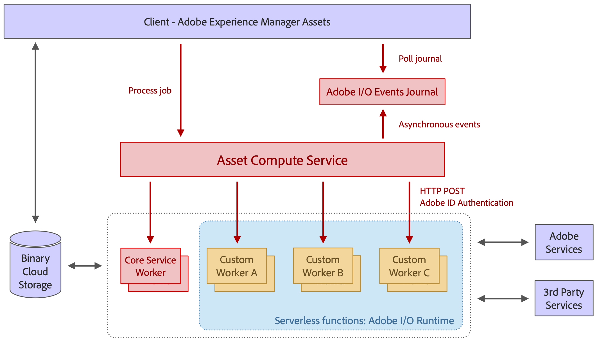

# Architecture of Asset Compute Service {#overview}

**TBD:**

This article can cover the following topics:

* Explain important transactions/handshakes?
* Flow of assets/control? See the illustration on the Nui diagrams wiki.
* Illustrations. See the SVG shared by Alex.
* Exceptions? Limitations? Call-outs? Gotchas?
  * Added elsewhere what the service does not do [here](introduction.md#possible-use-cases-benefits).
  * Do we want to add what basic processing is not available currently, that is expected by existing AEM customers?

The Asset Compute Service is built on top of serverless Adobe I/O Runtime platform. It provides Adobe Sensei content services support for assets, where a JSON file is returned with one or more client-chosen, Adobe Sensei-generated describing a single asset.

Asset Compute Service is extendable by creating custom workers based on [!DNL Project Firefly]. These custom workers are [!DNL Project Firefly] headless apps and do tasks such as add custom conversion tools or call external APIs to perform image operations.

[!DNL Project Firefly] is a framework to build and deploy custom web applications on [!DNL Adobe I/O] runtime. To create custom applications, the developers can leverage [!DNL React Spectrum] (Adobe’s UI toolkit), create microservices, create custom events, and orchestrate APIs. See [documentation of Project Firefly](https://www.adobe.io/apis/experienceplatform/project-firefly/docs.html).

The foundation on which the architecture is based includes:

* The modularity of workers – only containing what is needed for a given task – allows to decouple workers from each other and keep them lightweight. 

* The serverless concept of Adobe I/O Runtime yields numerous benefits: asynchronous, highly-scalable, isolated, job-based processing, which is a perfect fit for asset processing. 

* Binary cloud storage provides the necessary features for storing and accessing asset files and renditions individually, without requiring full access permissions to the storage, using pre-signed URL references. Transfer acceleration, CDN caching, and co-locating compute workers with cloud storage allow for optimal low latency content access. Both AWS and Azure clouds are supported.

The architecture is compatible with Adobe Experience Data Model (XDM) Schema that ensures forward and backward compatibility.[`xmp:machineKeywords`](https://github.com/adobe/xdm/blob/master/docs/reference/assets/asset.schema.md#xmpmachinekeywords) tracks Adobe Sensei-assigned descriptive phrases such as keywords or tags of a supported asset.



*Figure: Architecture of Asset Compute Service and how it integrates with Experience Manager, storage, and processing workers.*

The architecture consists of the following parts:

* **An API and orchestration layer** receives requests (in JSON format) which instruct the service to transform a source asset (or more) into multiple renditions. These requests are asynchronous and return with an activation id (aka "job id"). Instructions are purely declarative, and for all standard processing work (e.g. thumbnail generation, text extraction) consumers only specify the desired result, but not the workers that handle certain renditions.Generic API features such as authentication, analytics, rate limiting, are handled using the Adobe API Gateway in front of the service and manages all requests going to I/O Runtime. The worker routing is done dynamically by the orchestration layer. Custom workers can be specified by clients for particular renditions and include custom parameters. Worker execution can be fully parallelized as they are separate serverless functions in I/O Runtime.

* **Workers to process assets** that specialize on certain types of file formats or target renditions. Conceptually, a worker is similar to the Unix pipe concept: an input file gets transformed into one or more output files.

* **A [common worker library](https://github.com/adobe/asset-compute-sdk)** handles common tasks like downloading the source file, uploading the renditions, error reporting, event sending and monitoring . This is designed so that developing a worker stays as simple as possible, following the serverless idea, and can be restricted to local filesystem interactions.

<!--
An example of the JSON file is:

```json
{
    "xmp:machineKeywords": [
        {
            "value": "tree",
            "confidence": 0.8567
        },
        {
            "value": "brown",
            "confidence": 0.752
        }
    ]
}
```

-->

## Know the basic terminology {#glossary}

**TBD:**

* What do we want to populate here?
* Project Firefly and its term.
* AEMaaCS: See [https://docs.adobe.com/content/help/en/experience-manager-cloud-service/overview/introduction.html](https://docs.adobe.com/content/help/en/experience-manager-cloud-service/overview/introduction.html).

## Understand the required files and folders {#understand-purpose-of-files-folders}

**TBD:**

* About the YAML file?
* See [https://github.com/AdobeDocs/project-firefly/blob/master/getting_started/first_app.md#5-anatomy-of-a-project-firefly-application](https://github.com/AdobeDocs/project-firefly/blob/master/getting_started/first_app.md#5-anatomy-of-a-project-firefly-application).
