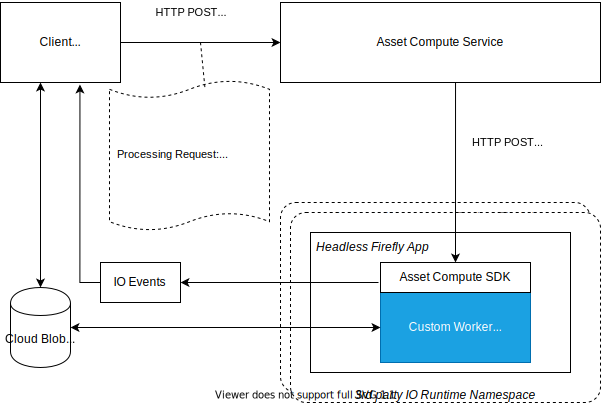

# Considerations to create and use a custom worker {#considerations-custom-worker}

It is simple to get started with serverless and OpenWhisk. Create a single NodeJS file, one `main` function accepting a `params` object, deploy with one `wsk` command and you can go live with it! In Asset Compute Service, it is kept this way. There are not additional complexities when creating a custom worker using Asset Compute Service. Extending Asset Compute Service with new workers is made simple through libraries, APIs, and build tooling. The simplification addresses the mundane work so that developers can focus on value-added tasks. An overly simplified way to create a worker is by creating a simple Shell script to integrate command line apps as workers.

<!-- Attention: Is it possible to provide a public-facing example of a basic Shell script as a worker. An internal sample is at https://git.corp.adobe.com/aklimets/project-nui/blob/master/actions/tika/worker.sh
-->

Note: Project Firefly provides command line tooling to help deploy and run custom workers. If working on a Project Firefly app, you would type `aio app deploy` to deploy the custom worker.

## Prerequisites and provisioning requirements {#provisioning}

Ensure you meet the following prerequisites:

* Project Firefly tools are installed on your machine.
* An Experience Cloud Organization. More information [here](https://github.com/AdobeDocs/project-firefly/blob/master/getting_started/setup.md#acquire-access-and-credentials).
* The Experience Organization must have AEM as a Cloud Service enabled.
* The Experience Organization must be added to Project Firefly developer preview program. If you do not have access to Project Firefly, read [here](https://github.com/AdobeDocs/project-firefly/blob/master/overview/getting_access.md) how you can apply for access.

**TBD:**

* What all accesses and licenses are required?
* What all permissions are required to create, debug, and deploy custom workers?
* How do developers get access and provision the required apps?
* Repository management

## Other considerations {#others}

**TBD**:

* Anything on security and data transfer?
* What about handling personal or sensitive information?
* Custom worker SLA is dependent on SLAs of various services it depends on.
* Document how the devs can get to know the KPIs of their custom workers. The KPIs are dependent on the performance at Adobe's side, amongst other things.

## Understand the workflow of a custom worker {#understand-the-working}

Understand the end-to-end workflow of a digital asset that is processed by Adobe Asset Compute using a custom worker and a generic client.



*Figure: Steps involved for processing an Asset using Adobe Asset Compute Service.*

### Registration {#registration}

The client must call [`/register`](api.md#register) once before the first request to [`/process`](api.md#process-request) in order to set up and retrieve the journal URL for receiving Adobe I/O Events for Adobe Asset Compute.

```sh
curl -X POST \
  https://asset-compute.adobe.io/register \
  -H "x-ims-org-id: $ORG_ID" \
  -H "x-gw-ims-org-id: $ORG_ID" \
  -H "Authorization: Bearer $JWT_TOKEN" \
  -H "x-api-key: $API_KEY"
```

The [`@adobe/asset-compute-client`](https://github.com/adobe/asset-compute-client#usage) JavaScript library can be used in NodeJS applications to handle all the necessary steps from registration, processing to asynchronous event handling. For more information on the required headers, see [Authentication and Authorization](https://git.corp.adobe.com/nui/nui/blob/master/doc/api.md#authentication-and-authorization).

### Processing {#processing}

The client sends a [processing](api.md#asset-processing) request.

```sh
curl -X POST \
  https://asset-compute.adobe.io/process \
  -H "x-ims-org-id: $ORG_ID" \
  -H "x-gw-ims-org-id: $ORG_ID" \
  -H "Authorization: Bearer $JWT_TOKEN" \
  -H "x-api-key: $API_KEY" \
  -d "<RENDITION_JSON>
```

The client is responsible for correctly formatting the renditions with pre-signed URLs. The [`@adobe/node-cloud-blobstore-wrapper`](https://github.com/adobe/node-cloud-blobstore-wrapper#presigned-urls) JavaScript library can be used in NodeJS applications to pre-sign URLs. Currently the library only supports Azure Blob Storage and AWS S3 Containers.

The processing request returns a `requestId` that can be used for polling Adobe I/O Events.

A sample custom worker processing request is below.

```json
{
    "source": "https://www.adobe.com/some-source-file.jpg",
    "renditions" : [
        {
            "worker": "https://my-project-namespace.adobeioruntime.net/api/v1/web/my-namespace-version/my-worker",
            "name": "rendition1.jpg",
            "target": "https://some-presigned-put-url-for-rendition1.jpg",
        }
    ],
    "userData": {
        "my-asset-id": "1234567890"
    }
}
```

The Asset Compute Service sends the custom worker rendition requests to the custom worker. It does so using an HTTP POST to the provided worker URL, which is the secured web action URL from Project Firefly. Note that all requests use the HTTPS protocol to maximize data security.

The [Asset Compute SDK](https://github.com/adobe/asset-compute-sdk#adobe-asset-compute-worker-sdk) used by a custom worker handles the HTTP POST request. It also handles downloading of the source, uploading renditions, sending I/O events and error handling.

<!-- TBD: Add the worker diagram. -->

#### Worker code {#worker-code}

Custom code only needs to provide a callback that takes the locally available source file (`source.path`). The `rendition.path` is the location to place the final result of an asset processing request. The custom worker uses the callback to turn the locally available source files into a rendition file using the name passed in (`rendition.path`). A custom worker must write to `rendition.path` to create a rendition:

```js
const { worker } = require('@adobe/asset-compute-sdk');
const fs = require('fs').promises;

// worker() is the entry point in the SDK "framework".
// The asynchronous function defined is the rendition callback.
exports.main = worker(async (source, rendition) => {

    // Tip: custom worker parameters are available in rendition.instructions.
    console.log(rendition.instructions.name); // should print out `rendition.jpg`.

    // Simplest example: copy the source file to the rendition file destination so as to transfer the asset as is without processing.
    await fs.copyFile(source.path, rendition.path);
});
```

#### Download source files {#download-source}

A custom worker only deals with local files. Downloading the source file is handled by the [Asset Compute SDK](https://github.com/adobe/asset-compute-sdk#adobe-asset-compute-worker-sdk).

#### Rendition creation {#rendition-creation}

The SDK invokes an asynchronous [rendition callback function](https://github.com/adobe/asset-compute-sdk#rendition-callback-for-worker-required) for each rendition.

The callback function has access to the [source](https://github.com/adobe/asset-compute-sdk#source) and [rendition](https://github.com/adobe/asset-compute-sdk#rendition) objects. The `source.path` already exists and is the path to local copy of source file. The `rendition.path` is the path where the processed rendition must be stored. Unless `disableSourceDownload` is set, The worker must use exactly the `rendition.path`, otherwise the SDK cannot locate or identify the rendition file.

The example above is an overly simplified worker that just copies the source file to the rendition destination.

For more information about the rendition callback parameters, see the Asset Compute SDK [API details](https://github.com/adobe/asset-compute-sdk#api-details).

#### Upload renditions {#upload-rendition}

After each rendition is created and stored in a file with the path provided by `rendition.path`, the [Asset Compute SDK](https://github.com/adobe/asset-compute-sdk#adobe-asset-compute-worker-sdk) uploads each rendition to a cloud (either AWS or Azure, depending of which one was requested to be used). A custom worker will get multiple renditions at the same time if, and only if, the incoming request has multiple renditions pointing to the same worker url. The upload to cloud storage is done after each rendition, and before running the callback for the next rendition. 

Note that `batchWorker()` has a different behavior, as this will actually process all renditions and only after all have been processed, will upload them.

### Adobe I/O Events {#aio-events}

The SDK sends Adobe I/O Events for each rendition. These events are either type `rendition_created` or `rendition_failed` depending on the outcome. See [Asset Compute asynchronous events](api.md#asynchronous-events) for events details.

### Receive Adobe I/O Events {#receive-aio-events}

The client polls the [Adobe I/O Events Journal](https://www.adobe.io/apis/experienceplatform/events/ioeventsapi.html#/Journaling) according to its consumption logic. The initial journal URL is the one provided in the `/register` API response. Events can be identified using the `requestId` that is present in the events and is the same as returned in `/process`. Every rendition has a separate event that gets sent as soon as the rendition has been uploaded (or failed). Once it receives a matching an event, the client can display or otherwise handle the resulting renditions.

The JavaScript library [`asset-compute-client`](https://github.com/adobe/asset-compute-client#usage) makes the journal polling simple using the `waitActivation()` method to get all the events.

```js
const events = await assetCompute.waitActivation(requestId);
await Promise.all(events.map(event => {
    if (event.type === "rendition_created") {
        // get rendition from cloud storage location
    }
    else if (event.type === "rendition_failed") {
        // failed to process
    }
    else {
        // other event types
        // (could be added in the future)
    }
}));
```

For details on how to get journal events, see [Adobe I/O Events API](https://www.adobe.io/apis/experienceplatform/events/ioeventsapi.html#!adobedocs/adobeio-events/master/events-api-reference.yaml).

**TBD:**

* Illustration of the controls/data flow.
* Basic overview, in text and not code, of how a workers works. See Alex's note at [https://git.corp.adobe.com/nui/nui/pull/290#discussion_r2875460](https://git.corp.adobe.com/nui/nui/pull/290#discussion_r2875460).
